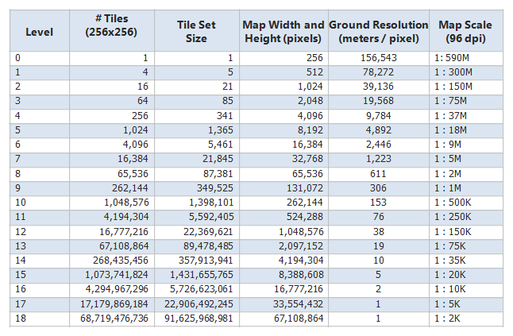

Aperture Tiles Components
=========================

Aperture Tiles implements a data flow that breaks the visualization process into three components: tile generation, tile server, and tile client. This flexible framework allows third parties to leverage or augment the pieces of Aperture Tiles as they see fit. For example:

- Using the Aperture Tiles Avro tile data format, third parties can produce custom tile data using their own analytics.
- Using the Aperture Tile Server standards-based [Tile Map Services](http://en.wikipedia.org/wiki/Tile_Map_Service), developers can integrate a third-party tile client.

## Distributed Tile Generation ##

The Aperture Tiles generation analytic leverages cluster computing with [Apache Spark](http://spark.incubator.apache.org/) to rapidly compute tiles from terabytes of "big data". The tile generation analytic transforms raw data into Avro data tile files with metadata descriptor files, summarizing all tile content. Avro data files allow for language neutrality and support multiple summaries per bin, allowing a flexible and extensible analytic. Finished tiles are stored in HBase to allow efficient scalability to billions of tiles.

### Tile Set Size and Resolution ###

 

## Tile Server ##

The Aperture Tile server provides services to serve rendered tiles or raw tile data. The Aperture Tile Server defines a REST API for requesting tiles and rendering properties. The tile server works by retrieving Avro data tile files and rendering PNG images for display in the tile client or external visualization applications. The Aperture Tile Server also has the ability to directly serve raw tile data via JSON, supporting data services or rich client side rendering capabilities.

## Tile Client ##

The Aperture Tile client is a full-featured, interactive web application for displaying layered tiles with zoom, pan, and filtering interactions. Example client side rendering (of aggregation marker visualization techniques) is provided to demonstrate some of the possibilities. The tile client web application is designed to promote:

- Initial exploratory data analysis
- Ongoing situation awareness and operational dashboards
 
This is handled by displaying high-level patterns and summary statistics while preserving fine detail at the appropriate zoom level.

## Next Steps ##

For more information on the process of developing a custom visual analytic with Aperture Tiles, see the [Process](../process/) topic.